# 🥬 개요
***
### 쉬우면서 전문적인 상권 분석 📊
## 🥬 요식업 맞춤 골목상권 분석 앱 `상추` 🥬

"**새로운 사업을 위해**, 어디에 나의 가게를 차리는 것이 좋을까?"    
사업은 인생을 바꿀만큼 큰 돈이 오가는 만큼, **그 무엇보다 시작점이 중요합니다.**     
그러므로 상권에 대한 올바른 분석이 사업의 성공을 가릅니다.  
우리는 서울시에서 음식점을 창업하고자 하는 자영업자들을 위한 **상권 분석 및 추천 서비스**를 제공합니다.

> 
직접 사용해보세요. (App store)

>
> 
  

***
# 🥬 서비스 소개
***

> [🥬 상추 서비스 홍보 영상](https://www.youtube.com/watch?v=ilijcCq1Lyc)

### 서울시 상권 Top 10 추천 (메인화면)

- 서울시에서 떠오르는 골목상권 순위를 10위까지 보여줍니다.

### 서울시 골목 상권 추천
- 직관적인 점수로 최고의 상권을 추천합니다.

### 상권 지표 그래프
- 인구, 인프라, 매출 관련 다양한 정보들을 그래프로 비교 분석할 수 있습니다.

### 자치구와 업종별 분석
- 창업을 원하는 자치구와 업종을 고려하여 분석할 수 있습니다.

  
  

### 북마크와 메모, 공유 기능
- 마음에 드는 상권을 북마크에 저장할 수 있습니다.
- 사진과 함께 메모를 저장하고 이를 카카오톡으로 공유할 수 있습니다.

  
  

### 상권 지도 및 길찾기
- 상권 영역을 직접 지도로 확인할 수 있습니다.
- 찾아가고 싶다면 길찾기 기능을 활용할 수 있습니다.

***
# 🥬 기술 스택
***

### 1) 모바일 
   **언어**: Swift 5.10  
   **프레임워크**: SwiftUI 5.10  
   **라이브러리**: Alamofire 5.5, swiftui-image-viewer 1.0.0  
   **개발환경**: XCode 15.3, CocoaPods 1.15.2  
   **그 외**: Figma

### 2) 백엔드 
   **언어**: Java 17, Python 3.11.5  
   **프레임워크**: Springboot 3.2.3, SpringSecurity 6.2.2, JPA 3.2.3  
   **라이브러리**: Lombok 1.18.22, Swagger 4.15.5, pandas 2.2.1, redis 5.0.3, scikit-learn 1.4.1.post1, SQLAlchemy 2.0.29  
   **개발환경**: IntelliJ 17.0.9+7-b1087.9 amd64, PyCharm Community Edition 2023.3.3  
   **그 외**: ERDCLOUD

### 3) 협업 툴 
   **이슈 관리** : JIRA  
   **형상 관리** : Gitlab, Docker 25.0.4  
   **커뮤니케이션** : Notion, Mattermost, Gerrit

### 4) 인프라 
   **서버 환경**: Amazon EC2 Ubuntu 20.04.6 LTS  
   **웹 서버**: Nginx 1.18.0

### 5) CI/CD 
   **배포 자동화 파이프라인**: Jenkins jdk17  
   **아티팩트 저장소**: Sonatype Nexus 3.66.0  
   **정적 분석**: SonarQube 4.4.1  
   **동적 분석**: Jmeter 5.6.3  
   **유저 메트릭 수집**: Prometheus 2.51.1  
   **분석 정보 시각화**: Grafana 10.3.5

### 6) Database 
   PostgreSQL 16.2, Redis 7.2.4

***
# 🥬 ERD
***

- PostgreSQL 내부 Data셋

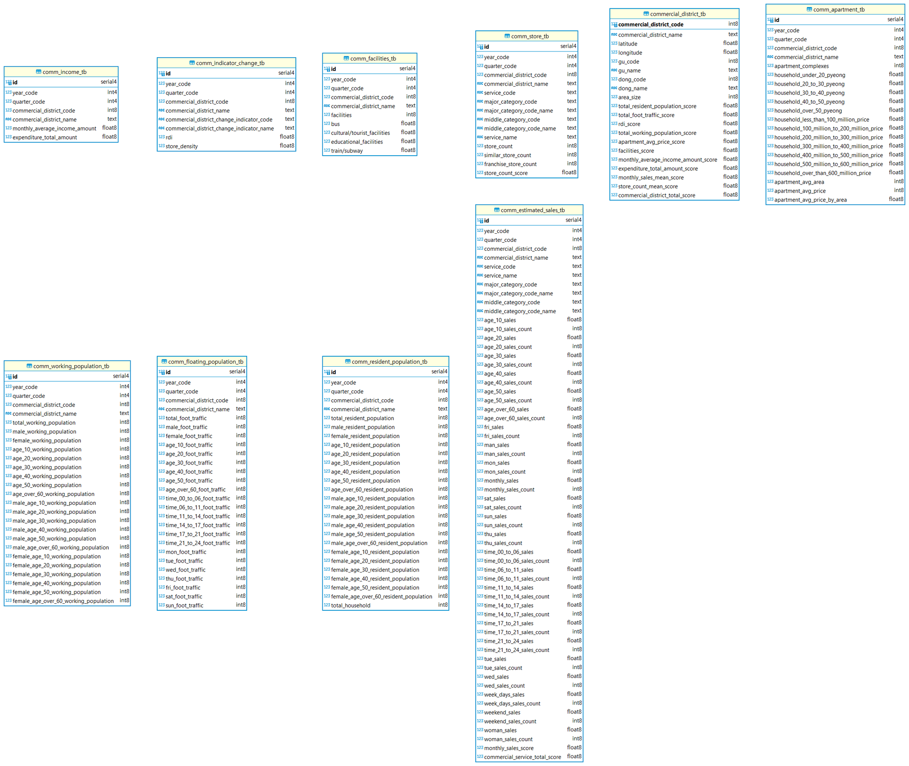

- PostgreSQL Data Table 연관관계

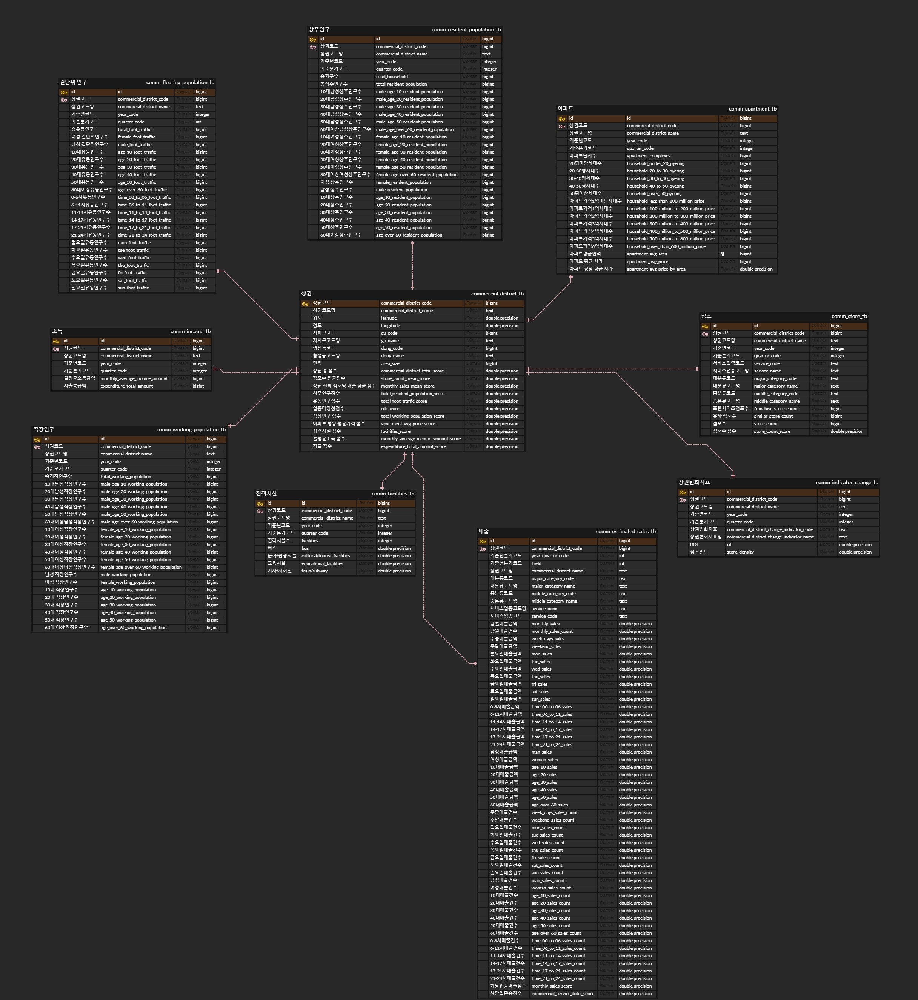

***
# 🥬 데이터 분석 모델
***

### 1. 선형회귀

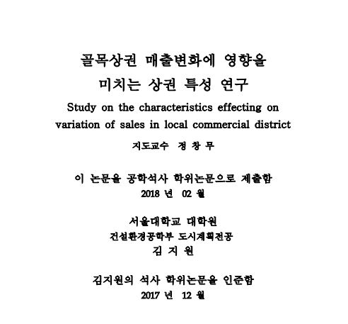

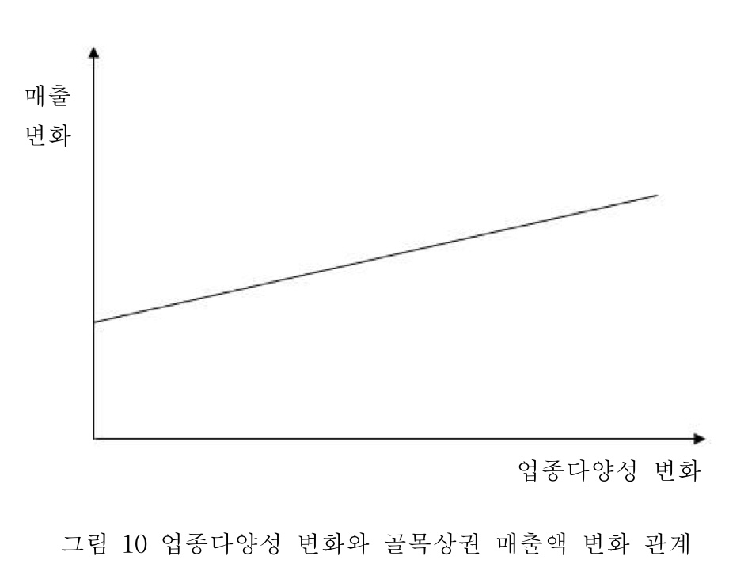

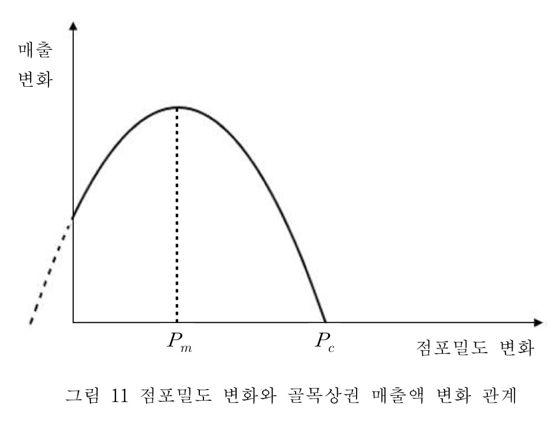

- 한 개 또는 그 이상의 변수들(`독립변수`)에 대하여 다른 변수(`종속변수`) 사이의 관계를 선형 모형을 이용하여 설명하고 예측하는 분석기법

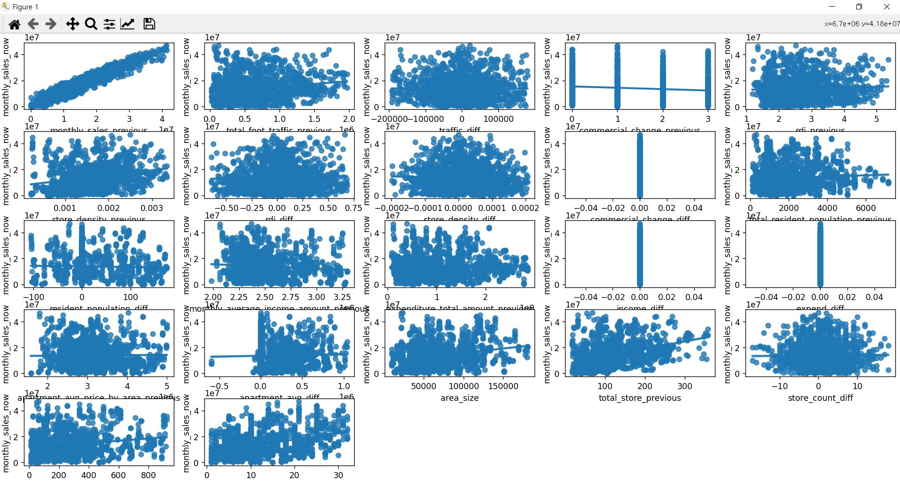

- 독립변수들을 정규화해서 사용했지만 변수들의 값이 선형과는 거리가 멀다는 것을 알 수 있다
- `RMSE`, `MAE`를 살펴봤을 때, 오차의 범위가 커서 모델 변경하기로 결정

### 2. 랜덤 포레스트 모델

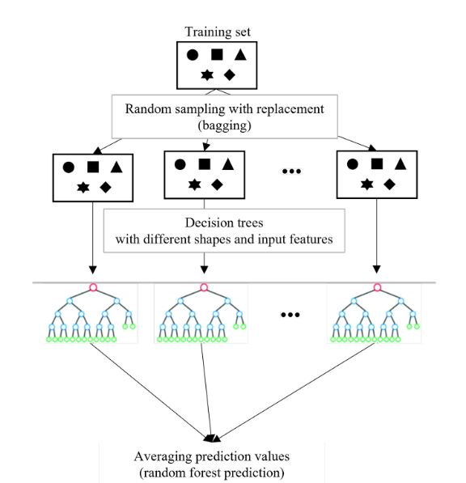

- 의사결정나무에 배깅이라는 앙상블 학습을 적용한 모델로, 여러 개의 결정 트리를 조합하여 더 강력한 분류 모델을 구축하는 방법
- `과접합`을 줄이고 `분산`을 감소시켜 **정확도가 높고 예측 성능을 향상시키는 데 효과적**
   - 랜덤 포레스트 적용 전

  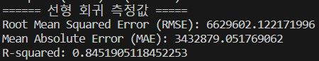

   - 랜덤 포레스트 적용 후

   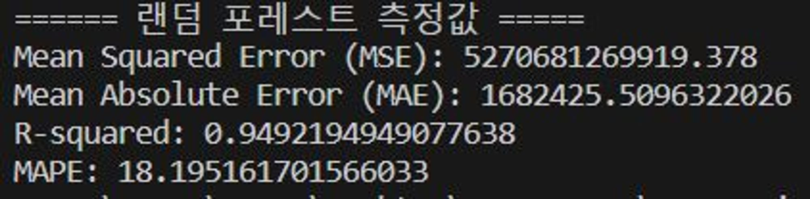

  `MSE`와 `MAE` 값이 많이 줄어듬을 볼 수 있다

### 3. 하이퍼 파라미터 튜닝

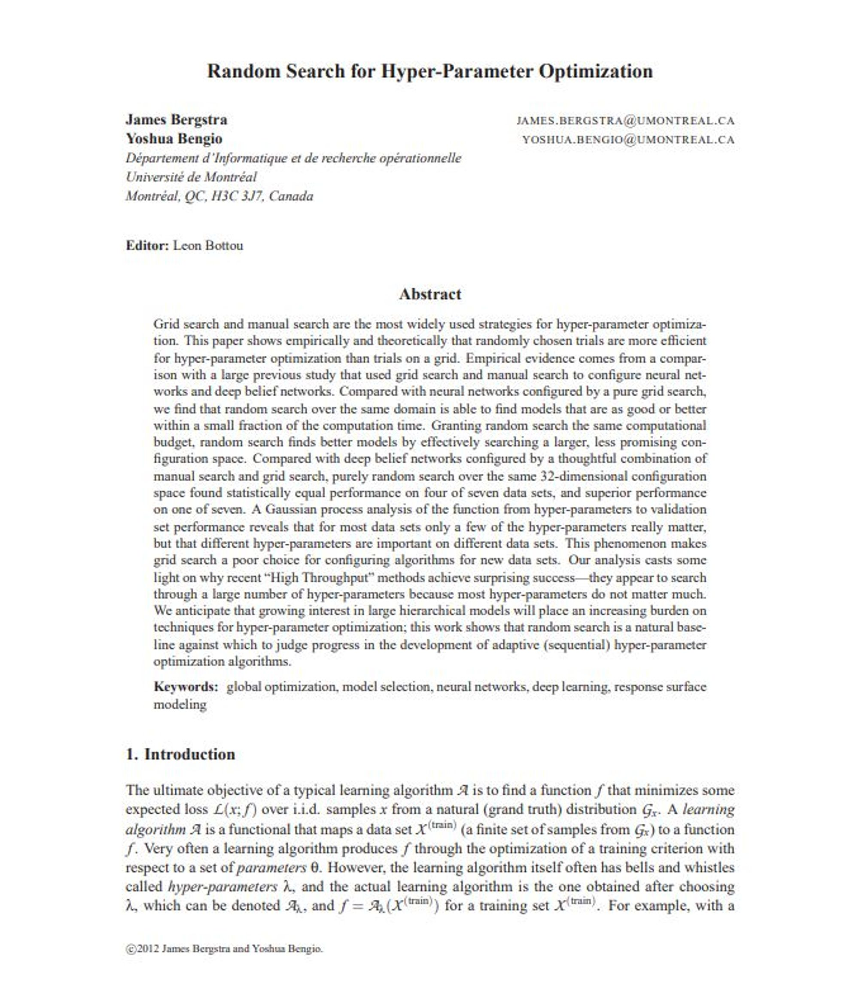

- 랜덤 포레스트 모델은 16개의 하이퍼 파라미터를 갖는다
- 이 하이퍼 파라미터의 값을 변경함에 따라 모델의 성능이 달라진다
- 최적의 하이퍼 파라미터 값을 찾아 랜덤 포레스트 모델의 성능을 개선시킨다
- Tree에서 제일 중요한 트리의 개수, 트리의 최대 깊이를 결정하는 하이퍼 파라미터를 설정해 Grid Search 알고리즘을 통해 최적의 하이퍼 파라미터 조합을 찾아낸다

   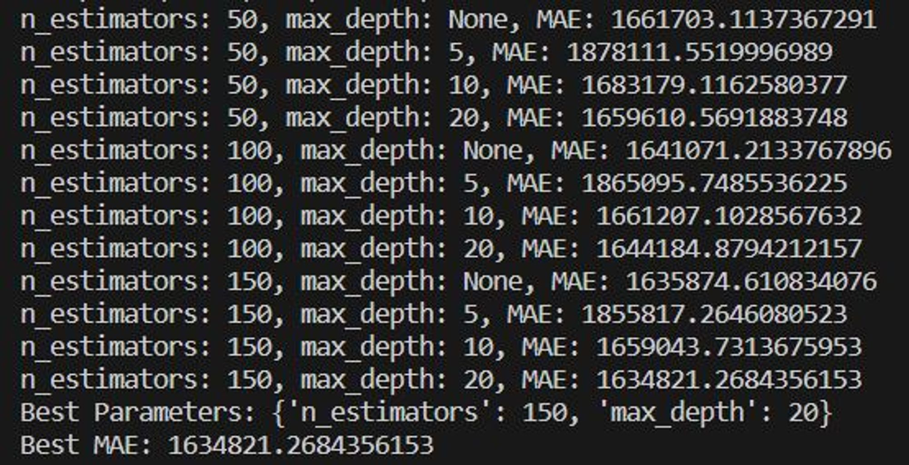

- 이 하이퍼 파라미터 값들을 랜덤 포레스트 모델에 적용하여 찾아낸 **최종 결과**
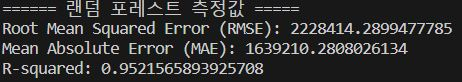

***
# 🥬 팀 소개
***

### 👑 박영규
 - 팀장(PM), 발표
 - Backend Springboot 점수 기반 상권 추천 서비스, 인프라 및 인구 관련 지표와 그래프 REST API
 - Infra 및 CI/CD 전반

### 🍏 안상준
- 모바일 리더, Swift
- Alamofire 기반 API 통신, 차트 및 지도 뷰, 공유기능
- 노션 문서화 작업 및 서기

### 🍎 양희태
- 모바일 Swift, 디자인
- Alamofire 기반 차트 및 랭킹 API 통신, 북마크 및 카메라 해시태그, 전체 디자인

### 📊 윤정인
- 빅데이터 모델 개발
- Backend REST API 리팩토링

### 👩‍💻 김희주
- Backend 리더, 디자인
- Backend Springboot 매출 그래프 REST API, 디버그, 리팩토링
- 데이터 그래프 시각화

### 🎈 안성재
- 데이터 전처리
- Backend 그래프 API 레디스 적용
- 빅데이터 모델 개발 보조
- 문서화 작업 및 서기

### 👥 팀 관리

#### Jira를 이용한 일정 관리

- **총 755개의 이슈**

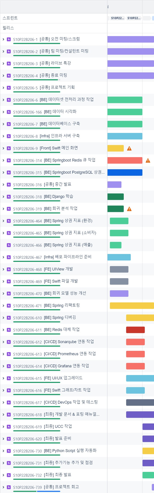

#### Gerrit을 이용한 코드 리뷰

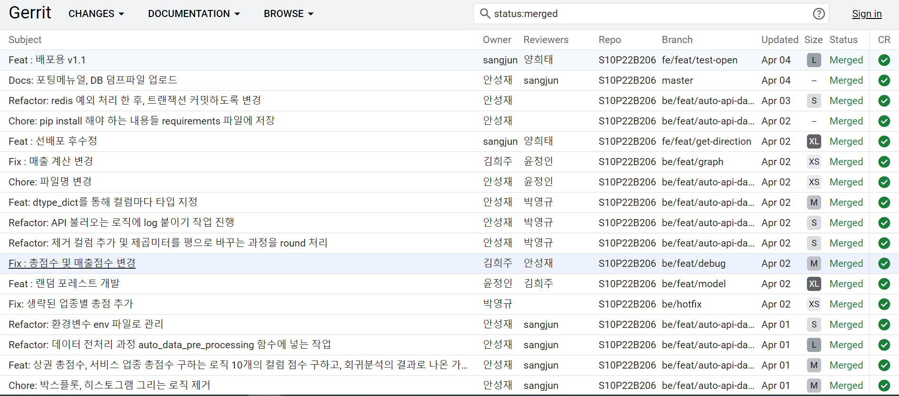

***
# 🥬 관련 문서
***

🥬 [금쪽유치원 Team Notion](https://mica-crate-425.notion.site/3be8545d8d814326a04399bc88532910?pvs=4)
 🥬 [프로젝트 소개 PPT](https://www.miricanvas.com/v/131l7b6)

